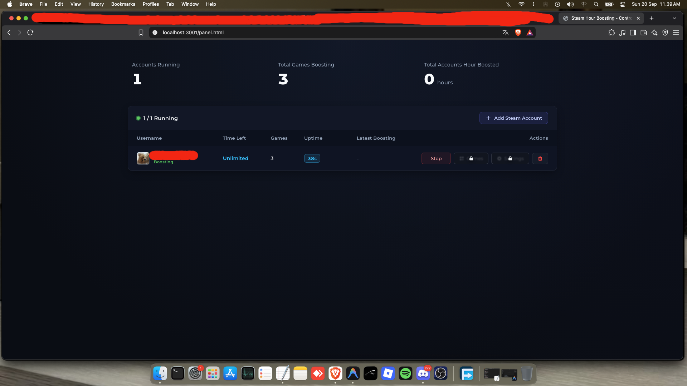
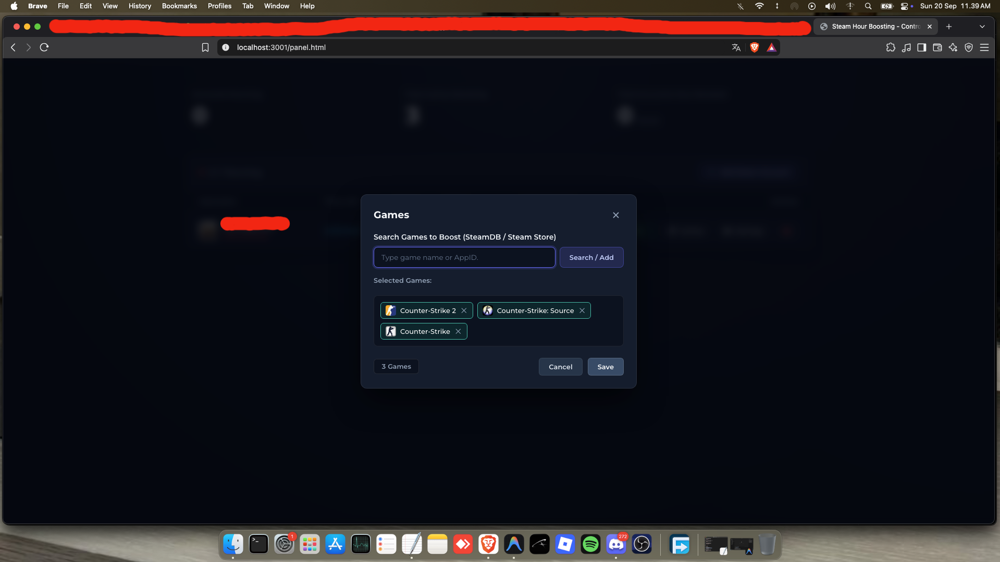
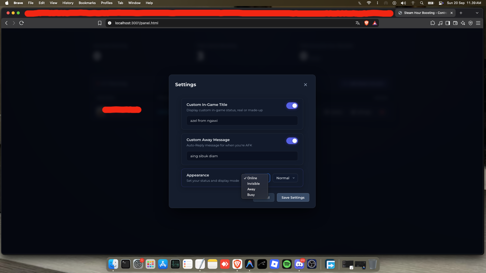
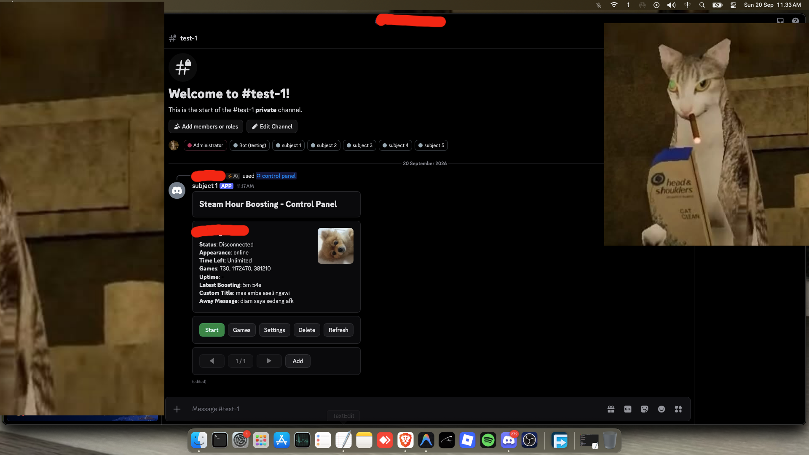
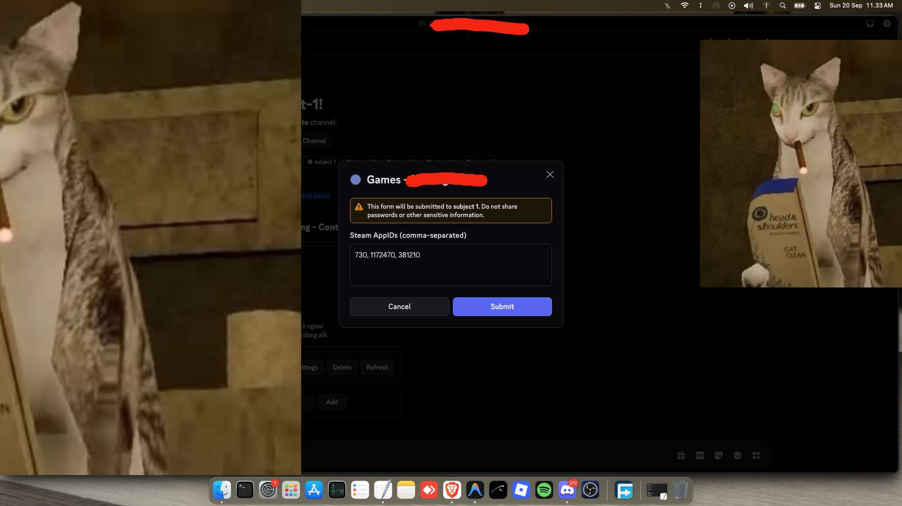
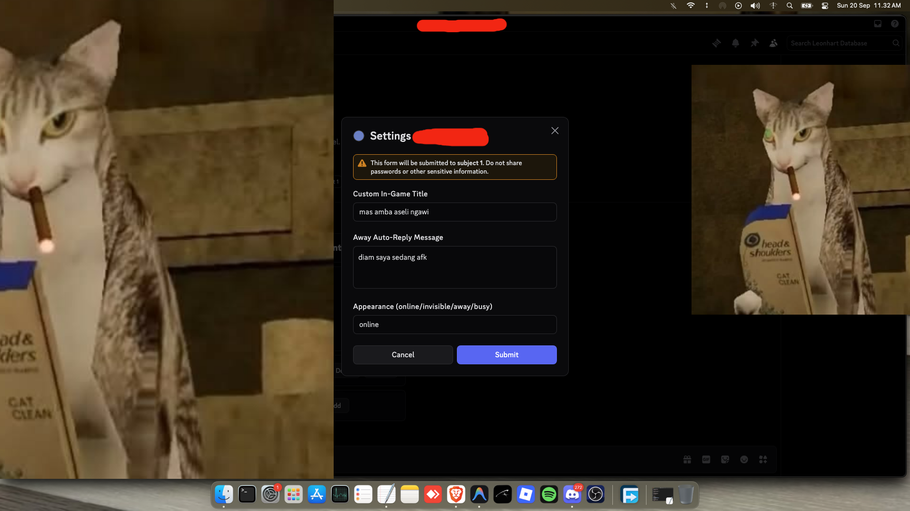
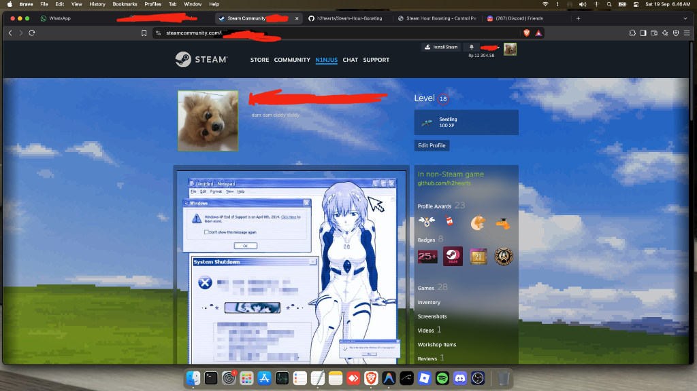
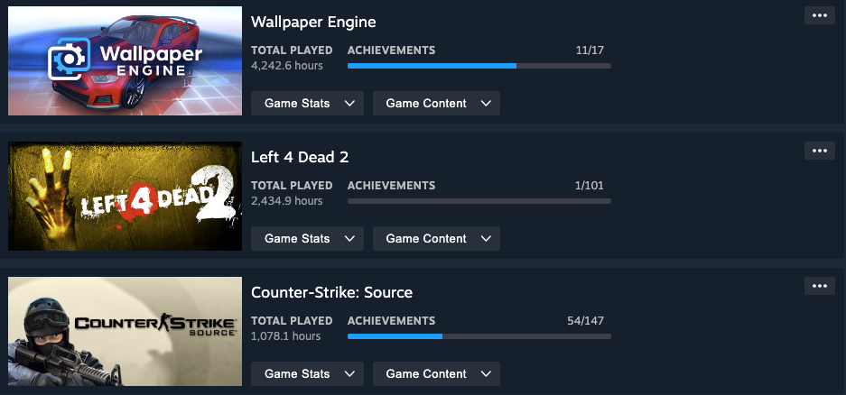

# Steam Hour Boosting

A lightweight, automated Steam hour booster available in two convenient versions: **Web Dashboard** and **Discord Bot**. Boost game hours across multiple Steam accounts simultaneously without downloading game files.

---

## Previews

### 1. Website Dashboard
Manage your accounts with a sleek web interface.

| Control Panel | Games Selector | Settings Modal |
|:---:|:---:|:---:|
|  |  |  |

---

### 2. Discord Bot
Control and monitor your hour boosting directly from your Discord server with interactive components.

| Control Panel | Games Modal | Settings Modal |
|:---:|:---:|:---:|
|  |  |  |

---

### 3. Steam In-Game Status & Boosted Hours

| Custom Status Title | Boosted Game Hours |
|:---:|:---:|
|  |  |

---

## Features

- **Multi-Account**: Manage and boost multiple Steam accounts simultaneously.
- **Custom In-Game Title**: Display custom text as your Steam in-game status (e.g. your URL, handle, or custom branding).
- **Appearance Status**: Set your persona state to **Online**, **Invisible**, **Away**, or **Busy**.
- **Away Auto-Reply**: Automatically reply to incoming Steam chat messages while boosting.
- **Smart Pause**: Automatically pauses boosting when you play games locally on your PC.
- **Steam Guard Support**: Full support for Steam Guard Mobile Authenticator & Email 2FA.
- **Auto-Reconnect**: Automatically reconnects and resumes boosting if Steam connection drops.
- **Two Management Options**: Use either the Web Dashboard or the Discord Bot.

---

## Installation & Setup

Clone the repository first:
```bash
git clone https://github.com/h2hearts/Steam-Hour-Boosting.git
cd Steam-Hour-Boosting
```

---

### Option A: Web Dashboard

#### 1. Install Dependencies
```bash
cd website/steam
npm install
```

#### 2. Start the Server
```bash
npm start
```
> For development with auto-reload: `npm run dev`

#### 3. Open in Browser
Open [http://localhost:3001](http://localhost:3001) in your browser to access the dashboard.

---

### Option B: Discord Bot

#### 1. Install Dependencies
```bash
cd discord-bot
npm install
```

#### 2. Configure Environment Variables
Create or edit `.env` inside `discord-bot/`:
```env
TOKEN_BOT=your_discord_bot_token
GUILD_ID=your_discord_guild_id
```

#### 3. Deploy Slash Commands
Register the `/control panel` slash command to your Discord server:
```bash
npm run deploy
```

#### 4. Start the Bot
```bash
npm start
```
> For development with auto-reload: `npm run dev`

#### 5. Open Control Panel in Discord
In your Discord server, type and run:
```
/control panel
```

---

## Security & Privacy

- **Credentials**: Account credentials and session tokens are stored locally on your machine in `config.json` and the `tokens/` directory.
- **Safety**: Never commit or share your `.env` file, `config.json`, or `tokens/` folder containing active credentials.

---

## License

MIT © [h2hearts](https://github.com/h2hearts)
